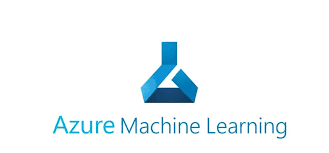
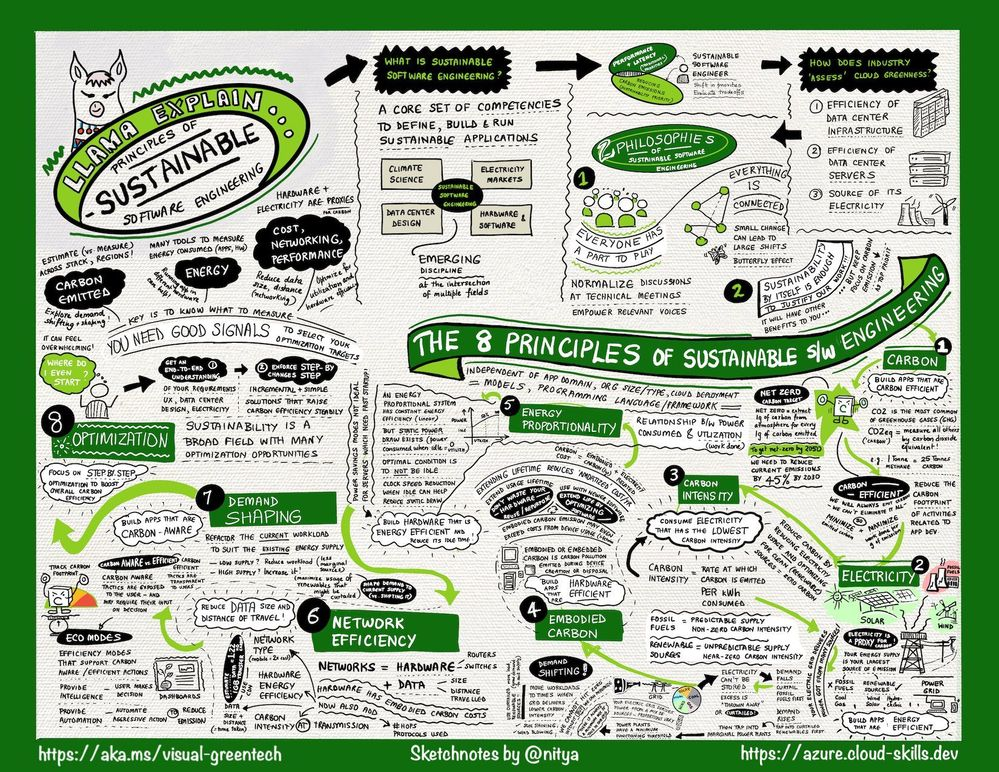

# Predict solar energy usage with Machine Learning Designer.

## Overview

In this workshop you will learn how to create a predictive machine learning model through the [Azure Machine Learning designer](https://docs.microsoft.com/en-us/azure/machine-learning/concept-designer).
You will be able to forecast the production of solar energy in a panel, based on climatic data and with it start on your way to a more sustainable life.

| **Project Goal**              | *Learn about Machine Learning model and how to train and deploy a predictive model*                                    |
| ----------------------------- | --------------------------------------------------------------------- |
| **What will you learn**       | Identify use cases for predictive models linked to sustainability.The use of technology in promoting environmental sustainability.                                        |
| **What you'll need**          | Internet Connection, an [Azure account](https://azure.microsoft.com),ability to navigate the Azure portal,basic concepts of Python and Pandas|
| **Duration**                  | 1-1.5 hours                                                               |
| **Just want to try the app or see the solution?** | [Reference Notebook](https://ml.azure.com/fileexplorerAzNB?wsid=/subscriptions/90617110-25a5-404c-8888-29477a22fe42/resourceGroups/ExamPractice/providers/Microsoft.MachineLearningServices/workspaces/AI900-practice&tid=84c31ca0-ac3b-4eae-ad11-519d80233e6f&activeFilePath=Users/ANDREW.CHAN/german_renewable_data_prep.ipynb)                          |
| **Slides** | [Powerpoint](slides.pptx)                          | **Weather data** | https://hkustconnect-my.sharepoint.com/:f:/g/personal/agchan_connect_ust_hk/Ei9Zm1rJSgxEiKS1y7ZlD88BrAVL7gmXOvi_kML54ahp2w?e=h3Amxu

## Pre-Learning
- [Get started with AI on Azure](https://docs.microsoft.com/en-us/learn/modules/get-started-ai-fundamentals/).
- [Azure Machine Learning designer](https://docs.microsoft.com/en-us/azure/machine-learning/concept-designer).
- [Use automated machine learning in Azure Machine Learning](https://docs.microsoft.com/es-mx/learn/modules/use-automated-machine-learning/).
- [The Principles of Sustainable Software Engineering](https://docs.microsoft.com/en-us/learn/modules/sustainable-software-engineering-overview/).

Acknowledgements: 
- Credits to Hugo Ferreira's article on renewable energy prediction in Germany, which is the basis for this workshop: Blog: https://medium.com/hugo-ferreiras-blog/predicting-wind-and-solar-generation-from-weather-data-using-machine-learning-998d7db8415e; Code: https://nbviewer.org/github/hugorcf/Renewable-energy-weather/blob/master/renewable.ipynb


## What students will learn

1. Students will be skilled at: 
        Get an introduction to machine learning
        Use the automated machine learning capability of Azure Machine Learning to train and deploy a predictive model.
        
2. Students will be able to independently use their learning to:
        Identify use cases for predictive models linked to sustainability.

3. Students will undersand the concepts of : 
        The use of technology in promoting environmental sustainability. 
        


## Video walk-through. 


>🎥 Click this image to watch EcoWatch team walk you through the workshop. 

## Pre-learning
- [Introduction to Python](https://docs.microsoft.com/en-us/learn/modules/python-data-science)

- [Pandas for Data Science](https://docs.microsoft.com/en-us/learn/modules/pandas-data-science)

- Manipulate and Clean Data on Python [workshop by Ornella](https://github.com/microsoft/workshop-library/blob/main/full/clean-prepare-data-python/README.md) 

## Prerequisites

- An [Azure account](https://azure.microsoft.com)

- An active [Azure subscription] (https://azure.microsoft.com/en-us/free/)

- [Azure Portal] (https://azure.microsoft.com/en-us/features/azure-portal/)

- Basic knowledge of [Python](https://www.python.org/downloads/).


## Milestone 1: Machine Learning and Regression Models. 

### Machine Learning
Machine learning is the foundation of most AI solutions, using math and statistics to build predictive models for unknown values. 

Machines learn from data, every day we create a large amount of information that can be collected and used by data scientists to train a machine learning model and create predictions and inferences based on the relationships found in the information.

[](https://www.microsoft.com/en-us/videoplayer/embed/RE4xAok?postJsllMsg=true)
>🎥 Click this image to watch several examples of how a machine learning model works. 

### Regression models in machine learning

The Regression is a form of machine learning that is used to predict a numeric label based on an item's features,  in which you train a model using data that includes both the features and known values for the label, so that the model learns to fit the feature combinations to the label. Then, after training has been completed, you can use the trained model to predict labels for new items for which the label is unknown.


[](https://docs.microsoft.com/en-us/learn/modules/understand-regression-machine-learning/)
>🔎 Click this image, to learn more about regression models in machine learning, 


## Milestone 2: Join hands with sustainability 

Among the great challenges we have today is the fact of promoting sustainability within our lives to face problems such as climate change and carbon emissions. 

In an effort to generate change, we have made this workshop so that you can see how feasible it is to use solar panels in a region based on information from a region and thus have an energy generation without emissions that is more friendly to the environment.

You can also be an agent of change within your projects by taking into account the [eight principles of sustainable software engineering](https://docs.microsoft.com/en-us/learn/modules/sustainable-software-engineering-overview/).


>♻️ [Visual Guide: To Sustainable Software Engineering](https://techcommunity.microsoft.com/t5/green-tech-blog/a-visual-guide-to-sustainable-software-engineering/ba-p/2130034) 


## Milestone 3: Getting the Dataset

```javascript
//code snippets to aid in the building process
```

> *See ipynb notebook: [Combined dataset](https://ml.azure.com/fileexplorerAzNB?wsid=/subscriptions/90617110-25a5-404c-8888-29477a22fe42/resourceGroups/ExamPractice/providers/Microsoft.MachineLearningServices/workspaces/AI900-practice&tid=84c31ca0-ac3b-4eae-ad11-519d80233e6f&activeFilePath=Users/ANDREW.CHAN/combined_german_renewable.csv)*

## Milestone 4: Create and run training pipeline

> See the Azure Machine Learning designer 

## Milestone 5: Understand and Test the model.

> See the Azure Machine Learning designer 

## Milestone 6: Deploy a model as a service. 

> See the Azure Machine Learning designer 


## Test your knowledge. 

You have come a long way in your learning journey, it's time to put your knowledge to test and prove that you have learnt it right. Attempt a quick quiz on *Kahoot*
[here](https://kahoot.it/challenge/04702208?challenge-id=c8b92fa6-4ccf-4cf3-abb7-425034be7dda_1647843077705).


## Optional Transfer knowledge activity

Now that you have learned a little more about the use of machine learning and how it can help us achieve a more sustainable life, use this workshop to teach your friends or colleagues to raise awareness about the use of renewable energy with this [slides](./Slides.pptx). 


## Feedback

Be sure to give [feedback about this workshop](https://forms.office.com/r/MdhJWMZthR)!

[Code of Conduct](CODE_OF_CONDUCT.md)

